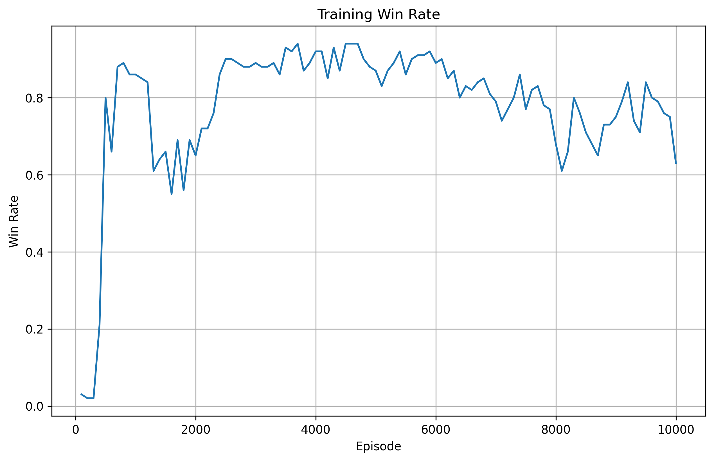

# TileDance

TileDance is a work-in-progress reinforcement learning project for Mahjong.

The current version uses a simplified single-player Mahjong environment and a Deep Q-Network (DQN) agent.

## Current Features

- 34-dimensional tile-count state
- 14 discard actions
- DQN with experience replay
- Target network
- Vectorized mini-batch training
- Epsilon-greedy exploration
- Simple reward shaping
- Training metrics and visualization

## Current Result

The current baseline reached a peak training win rate of about **94%** over a 100-episode window.

This is still a training result with `epsilon = 0.1`, so a separate greedy evaluation is planned.

## Current Limitations

- No Pong
- No Kong
- No opponents
- No multi-player turns
- Simplified Mahjong rules

## Next Steps

- Add a separate evaluation loop
- Add action masking
- Add Pong and Kong mechanics
- Expand toward a multi-player environment
- Experiment with improved DQN variants

## Status

Early development. The current goal is to build a stable RL baseline before expanding the Mahjong rules.